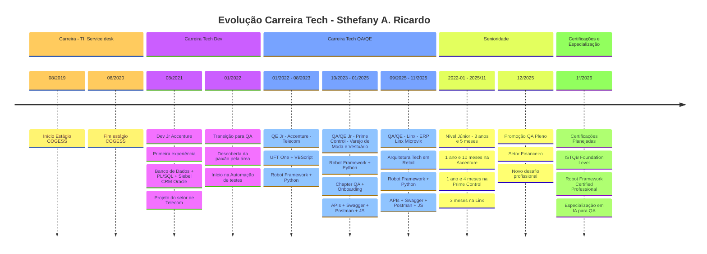
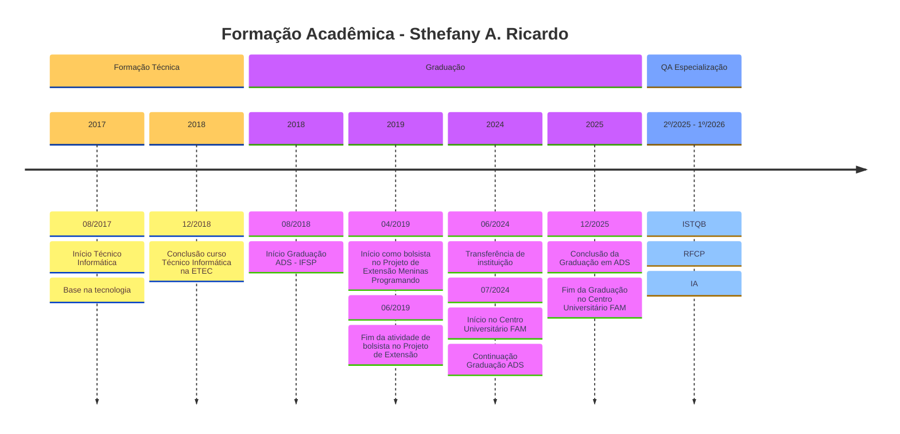

# [+ao+meu+perfil!)](https://git.io/typing-svg)

<!-- markdownlint-disable MD033 -->
<div align="center" markdown="1">
  
[](https://www.linkedin.com/in/sthefanyricardo/)
[](mailto:sthefannyricardo@gmail.com)
[](mailto:sthefanyricardo@outlook.com.br)

<hr>

</div>

## 👩‍💻 Sobre mim

Profissional da área **Qualidade de Software** com mais de **3 anos de experiência**, formada em **Técnico em Informática** e **graduanda em Análise e Desenvolvimento de Sistemas** (conclusão em dezembro/2025).

💜 Sou apaixonada pela **área de engenharia de qualidade de software**, melhoria contínua e boas práticas de desenvolvimento. Tenho **perfil Lifelong Learning** com foco constante em evolução profissional e tecnologias emergentes.

🎯 **Missão profissional:** Garantir a qualidade e confiabilidade de software através de processos QA, automação de testes e processos, mentoria de equipes e implementação de boas práticas em testes de softwares.

### 🚀 Destaques da Carreira

- **+3 anos** de experiência sólida em QA e Automação de Testes  
- Atuação em projetos dos setores de **Telecom**, **Varejo de moda e vestuário** e **ERP especializado Varejo e Varejo de Moda**
- **Expertise** em projetos de **testes funcionais, não funcionais e exploratórios** (Front-end e Back-end)
- Atuação em equipes de **Chapter de QA e Arquitetura** com suporte e/ou colaboração em liderança técnica
- Colaboração em **melhoria contínua de processos de qualidade**
- Suporte e colaboração ao **Onboarding e Capacitação** de novos QAs
- **Arquitetura de projetos** - Competência de estruturar e organizar projetos de automação de testes do zero
- Implementação de **boas práticas** em projetos de automação de testes com Robot Framework
- **Refatoração e otimização** de estruturas de automação de testes existentes

---

## 🌟 Minha jornada profissional e acadêmica

### 🌱 Timeline Mermaid - Jornada Profissional



### 🎓 Timeline Mermaid - Jornada Acadêmica



---

## 🎯 Experiência e Competências

### 🏆 Atuação Profissional

- **Cargo Atual:** Analista de Qualidade de Software Pleno (QA/QE)
- **Foco Estratégico:** Automação de Testes APIs e Web/UI + Liderança Técnica
- **Principais Competências:**
  - **+3 anos** de experiência em QA e Automação de Testes
  - Expertise em automação de testes com **Robot Framework** e **Python**
  - Expertise em testes de APIs Rest com **Postman** e **JavaScript**
  - **Arquitetura completa** de frameworks de automação de testes com Robot Framework e Python
  - Experiência com **múltiplos ambientes** e **homologação do produto**
  - **DevOps & CI/CD** - Integração contínua e pipelines automatizados
  - **Mentoria** - Capacitação e onboarding de equipes QA
  - **Gestão de plano e casos de teste:**
    - Planejamento e desenvolvimento de plano e casos de teste
    - Planejamento e desenvolvimento de casos de teste automatizados
  - **Documentação técnica** Planejamento, execução e documentação de projetos
  
### 🐞 Tipos de Testes

- ✅ Testes funcionais e não funcionais
- ✅ Testes Exploratórios
- ✅ Consultas e validações em Banco de Dados
- ✅ Testes de APIs e Contratos
- ✅ Testes de Performance
- ✅ Testes automatizados web/UI (Front-end)
- ✅ Testes automatizados de APIs (Back-end)
- ✅ Testes de regressão automatizados (Front-end e Back-end)

### 🤖 Testes Automatizados

| Tipo | Tecnologias & Abordagem |
|------|-------------------------|
| 🌐 Web/UI | Selenium e Browser Library + Robot Framework e Python, Cypress, Playwright |
| 🔌 APIs Rest e GraphQL | Postman + JavaScript, Swagger, Validação de JSON Schema com bibliotecas em Pyhton ou JavaScript, Requests Library + Robot Framework e Python, Testes de Contrato com Python ou Pact |
| 🗄️ Banco de Dados | SQL Server, Oracle, MongoDB, Consultas e Validações complexas |
| 🔄 Regressão | Suítes de testes automatizadas Full Stack (Front-end + Back-end + APIs) |

### ⚙️ Práticas e Metodologias

- **Metodologias:** Scrum/Kanban, Continuous Testing, TDD/BDD
- **DevOps:** Azure DevOps, Git, Pipelines CI/CD, Docker

---

## 🦾 Principais Hard skills


## 🛠️ Meu conjunto de tecnologias e ferramentas

| Categoria                           | Tecnologias & Ferramentas                                                                       |
|-------------------------------------|-------------------------------------------------------------------------------------------------|
| 👩‍🎨 Frontend                         | `JavaScript`, `HTML`, `CSS`, `Bootstrap`,`Markdown`                                            |
| 👩‍💻 Backend                          | `Python`, `JavaScript`, `VBScript`, `C#`, `PL/SQL`, `SQL`, `Java`                              |
| 🗃️ Banco de Dados                   | `SQL Server`, `MySQL`, `Oracle`, `PostgreSQL`, `MongoDB`, `phpMyAdmin`, `Oracle BRM`, `DBeaver` |
| 🔧 IDEs                             | `VS Code`, `PyCharm`, `Visual Studio`, `Android Studio`, `Eclipse`, `IntelliJ`                  |
| 🤖 Automação de Testes              | `Robot Framework`, `Selenium Libraries`, `Playwright Library`, `Pytest`, `UFT One`, `Cypress`   |
| 🐞 Testes Manuais de API            | `Postman`, `Insomnia`, `Swagger`, `SoapUI`, `API GraphQL`, `Apollo GraphQL`,                   |
| 📊 Gerenciamento de Projetos        | `Azure DevOps`, `Jira`, `Trello`                                                                |
| 📈 Gestão de testes de software     | `Azure Test Plans`, `Confluence`, `TestLink`, `QAse.io`, `Notion`, `HP Quality Center`          |
| :octocat: Versionamento de Código   | `Azure Repos`, `Git`, `GitHub`, `Bitbucket`                                                      |
| 🔨 Outros                           | `Pacote Office (Word, Excel, PowerPoint)`                                                       |

---

## 📚 Estudando atualmente

```python
roadmap_estudos_2025 = {
    "foco_principal": [
        "Robot Framework (nível avançado)", 
        "Automação de Testes de APIs", 
        "Postman Academy - Certification Program"
    ],
    "tecnologias_emergentes": [
        "CI/CD focado em automação", 
        "IA aplicada em QA (Test Generation, Bug Prediction)",
        "IA, MCP (Model Context Protocol), Agents, LLMs"
    ],
    "certificações": [
        "ISTQB Foundation Level", 
        "Robot Framework Certified Professional (RFCP)",
        "Postman API Testing Certificate"
    ],
    "cursos_plataformas": [
        "Test Beyond", 
        "Qualiters Club", 
        "Postman Academy", 
        "Assinatura Vitalícia Origamid", 
        "Assinatura Individual Mensal Udemy"
    ],
    "leitura_tecnica": [
        "Agile Testing: A Practical Guide - Lisa Crispin",
        "The Art of Software Testing - Glenford J. Myers"
    ],
    "livros": [
        "-", 
        "-"
    ]
}
```

---

## 🧠 Soft Skills & Competências Comportamentais

```python
soft_skills = {
    "🎯 lideranca_tecnica": ["Mentoria de equipes", "Code Review", "Arquitetura de projetos"],
    "🤝 colaboracao": ["Trabalho em equipe ágil", "Chapter QA", "Cross-team collaboration"],
    "🔍 resolucao_problemas": ["Troubleshooting", "Root cause analysis", "Critical thinking"],
    "📚 aprendizado_continuo": ["Lifelong learning", "Adaptabilidade", "Curiosidade técnica"],
    "📝 comunicacao": ["Documentação técnica", "Apresentações", "Knowledge sharing"],
    "⏰ gestao": ["Priorização", "Deadlines", "Multitasking", "Organização"]
}
```

---

## 📌 GitHub Stats


  


---

## 💬 Vamos Conversar?

🎯 **Interessado em discutir sobre:**

- 🤝 Networking e troca de experiências
- 🤖 Automação de Testes e boas práticas
- 🔧 Arquitetura de frameworks de teste
- 📈 Implementação de QA em times ágeis
- 🚀 Carreira em Quality Assurance
- 👩‍🏫 Mentorias em automação de testes

Sinta-se à vontade para me contatar:

[](https://www.linkedin.com/in/sthefanyricardo/)
[](mailto:sthefannyricardo@gmail.com)
[](mailto:sthefanyricardo@outlook.com.br)


---

<!-- markdownlint-disable MD033 -->
<div align="center" markdown="1">

### ⭐ "A qualidade nunca é um acidente, é sempre o resultado de um esforço inteligente." - John Ruskin

### ⭐ "Quality is never an accident, it is always the result of intelligent effort." - John Ruskin


#### Feito com 💜 e muito ☕

</div>
